<picture>
  <source media="(prefers-color-scheme: dark)" srcset="assets/banner-dark.svg">
  
</picture>

  
  
  

Hola 👋 Soy **Santi**. Estudio Ingeniería en Inteligencia Artificial en la UdeSA y desde 2020 trabajo por mi cuenta para escribanías y pymes. Empecé administrando su infraestructura y hoy desarrollo y opero sistemas en producción: desde un comparador de 1.182 casas de cambio en Colombia hasta un LLM que vive en el servidor de una escribanía.

🗣️ español, inglés y un poquito de francés

## 🚀 En qué trabajo

  <a href="https://preciodeldolar.com.co"><picture><source media="(prefers-color-scheme: dark)" srcset="assets/work-pdc-dark.svg"></picture></a>
  <picture><source media="(prefers-color-scheme: dark)" srcset="assets/work-llm-dark.svg"></picture>

  <a href="https://github.com/joacocullen/cot-compress"><picture><source media="(prefers-color-scheme: dark)" srcset="assets/work-research-dark.svg"></picture></a>
  <picture><source media="(prefers-color-scheme: dark)" srcset="assets/work-infra-dark.svg"></picture>

## 🎓 Proyectos de la facultad

  <a href="https://github.com/joacocullen/cot-compress"><picture><source media="(prefers-color-scheme: dark)" srcset="assets/uni-cot-dark.svg"></picture></a>
  <picture><source media="(prefers-color-scheme: dark)" srcset="assets/uni-derma-dark.svg"></picture>

  <picture><source media="(prefers-color-scheme: dark)" srcset="assets/uni-clearwave-dark.svg"></picture>
  <a href="https://github.com/joaco1212004/Ingenieria_de_Software---Groba-Salomon-Di_Cola"><picture><source media="(prefers-color-scheme: dark)" srcset="assets/uni-pozos-dark.svg"></picture></a>

## 🧰 Herramientas

  <picture>
    <source media="(prefers-color-scheme: dark)" srcset="https://skillicons.dev/icons?i=py,ts,c,cpp,java,pytorch,postgres,nextjs,react,fastapi,docker,linux,aws,nginx,prometheus,grafana,githubactions&perline=9&theme=dark">
    
  </picture>

y también vLLM · llama.cpp · Ollama · Qdrant · dbt · Dagster · MLflow

<picture>
  <source media="(prefers-color-scheme: dark)" srcset="assets/footer-dark.svg">
  
</picture>

hecho en Buenos Aires 🇦🇷

